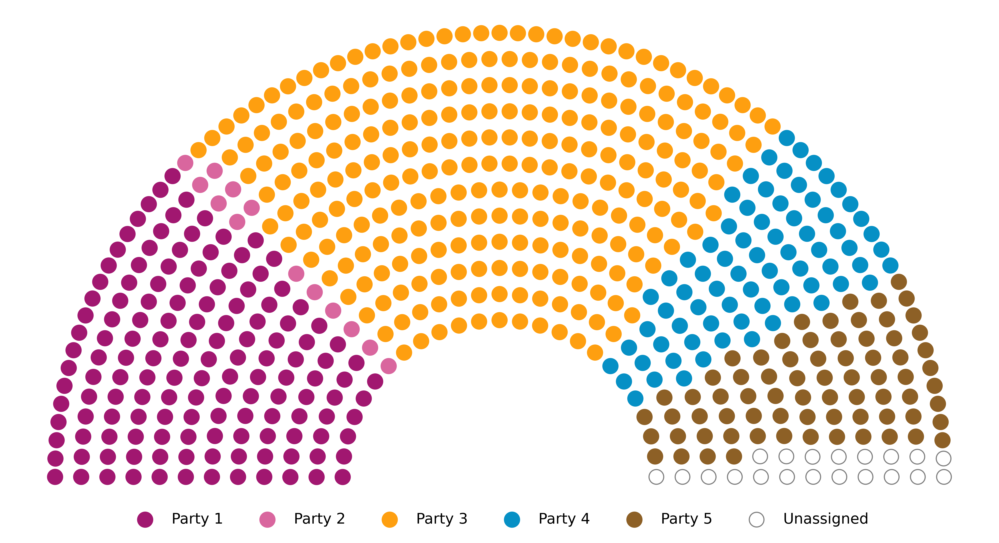
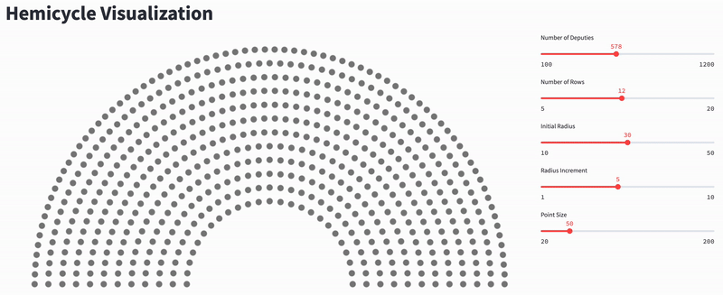

<!----------------------------------------------------------------------->
<a name="readme-top"></a>
<!----------------------------------------------------------------------->

<table width="100%" style="border: none;">
  <tr>
    <td align="left" style="border: none;"><b>LE GOURRIEREC Titouan</b></td>
    <td align="left" style="border: none;"></td>
    <td align="right" style="border: none;">
      <a href="https://www.linkedin.com/in/titouanlegourrierec"></a>
      <a href="mailto:titouanlegourrieræec@icloud.com"></a>
      <!-- <a href="https://titouanlegourrierec.github.io"></a> -->
    </td>
  </tr>
</table>

<!----------------------------------------------------------------------->
<!----------------------------------------------------------------------->

<!-- PROJECT LOGO -->
<br />
<div align="center">
  <!-- <a href="https://github.com/othneildrew/Best-README-Template">
    
  </a> -->

  <h3 align="center">Hemicycle Chart </h3>
  Tool for visualizing parliamentary seating with party distribution in a hemicycle.
  <p align="center">
    <br />
    <!-- <a href="https://github.com/othneildrew/Best-README-Template">View Demo</a>
    ·
    <a href="https://github.com/othneildrew/Best-README-Template/issues/new?labels=bug&template=bug-report---.md">Report Bug</a>
    · -->
    <a href="https://github.com/titouanlegourrierec/hemicycle-chart/issues">Report a bug · Request Feature</a>
  </p>
</div>


<!-- TABLE OF CONTENTS -->
<details>
  <summary>Table of Contents</summary>
  <ol>
    <li>
      <a href="#about-the-project">About The Project 📖</a>
      <ul>
        <li><a href="#built-with">Built With 🛠️</a></li>
      </ul>
    </li>
    <li><a href="#usage">Usage</a></li>
  </ol>
</details>

<!----------------------------------------------------------------------->
<!----------------------------------------------------------------------->

## About The Project

<p align="center">
  
</p>

This project provides an easy way to visualize parliamentary seating in the form of a hemicycle, illustrating the distribution of deputies by party. It simplifies the process of generating accurate and clear representations of legislative assemblies, making it useful for data analysis, presentations, and political studies. The tool is flexible and customizable to fit different parliamentary structures and compositions.

<!----------------------------------------------------------------------->
<p align="right">(<a href="#readme-top">back to top</a>)</p>
<!----------------------------------------------------------------------->


### Built With
* [![Python][Python-badge]][Python-url]


<!----------------------------------------------------------------------->
<p align="right">(<a href="#readme-top">back to top</a>)</p>
<!----------------------------------------------------------------------->

## Usage

To select different parameters, you can use the demo application here:

<div align="center">
  <a href="https://github.com/othneildrew/Best-README-Template">
    
  </a>
</div>

Then, choose the parameters `NUM_ROWS`, `INITIAL_RADIUS`, `RADIUS_INCREMENT`, and `POINT_SIZE` in the `chart.ipynb` file.

You also need to provide the distribution of the hemicycle in the following format:

```python
parties = [
    Party('Party 1', '#A11770', 142),
    Party('Party 2', '#D9669E', 13),
    Party('Party 3', '#FE9F10', 257),
    Party('Party 4', '#0690C5', 73),
    Party('Party 5', '#8D6026', 72),
    Party('Unassigned', 'unassigned', 20),
]
```
where the first element of Party() is the party name, the second element is the party's hexadecimal color code (if 'unassigned', it will be a white circle with a grey border), and the third element is the number of deputies in the party.

<!----------------------------------------------------------------------->
<p align="right">(<a href="#readme-top">back to top</a>)</p>
<!----------------------------------------------------------------------->

## Contact

LE GOURRIEREC Titouan - [titouanlegourrierec@icloud.com](mailto:titouanlegourrierec@icloud.com)

Repository Link: [https://github.com/titouanlegourrierec/Hemicycle-Chart](https://github.com/titouanlegourrierec/Hemicycle-Chart)


<!----------------------------------------------------------------------->
<p align="right">(<a href="#readme-top">back to top</a>)</p>
<!----------------------------------------------------------------------->

[Python-badge]: https://img.shields.io/badge/python-3670A0?style=for-the-badge&logo=python&logoColor=ffdd54
[Python-url]: https://www.python.org